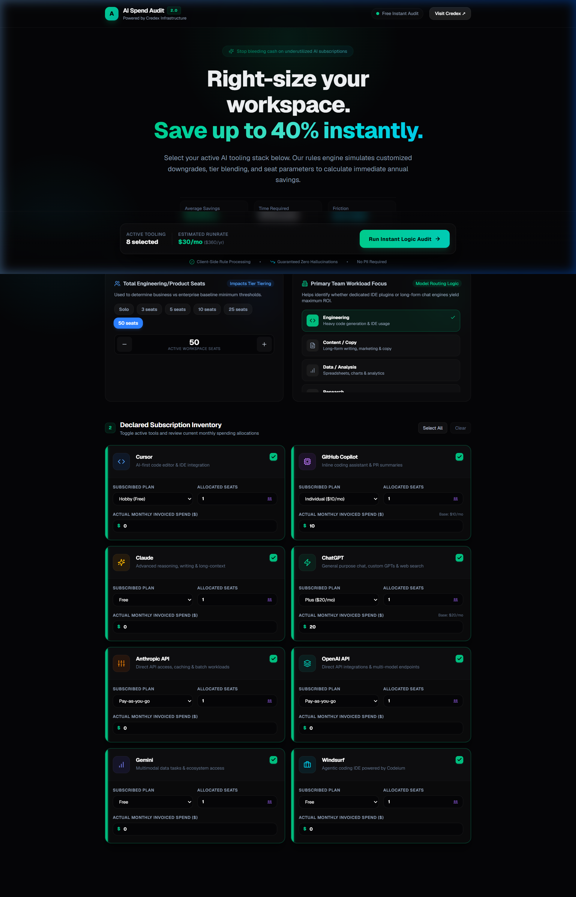
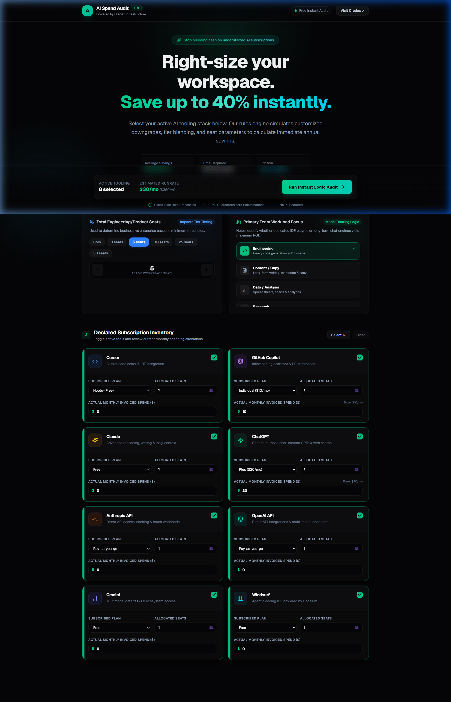
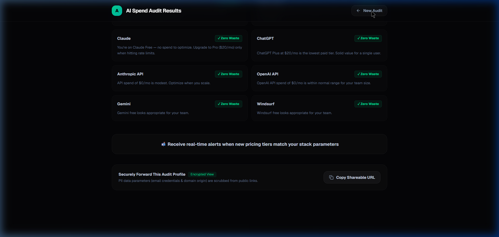

# SpendScope — AI Tool Cost Audit

SpendScope is a free web app that audits your team's AI tool spend in 2 minutes — surfacing overspend, right-sizing recommendations, and total savings, with no login required. It's a lead-generation tool for Credex, which sells discounted AI infrastructure credits.

**Live:** [spendscope.credex.rocks](https://spendscope.credex.rocks) · **Built for:** startup founders and engineering managers paying for AI tools.

---

## Screenshots

> Add 3+ screenshots or a 30-second Loom recording here after deploying.

| Landing | Form | Results |
|---------|------|---------|
|  |  |  |

---

## Quick Start

### Prerequisites

- Node.js 20+
- npm

### Run locally (no accounts needed)

```bash
git clone https://github.com/Prakhar1839/credex-audit
cd credex-audit
npm install
cp .env.example .env.local
npm run dev
```

Open [http://localhost:3000](http://localhost:3000). The app works fully without any environment variables — it uses a local JSON file store (`.data/`) and logs emails to the console.

### Add services (optional)

1. **Supabase** — create a project, run `supabase/schema.sql`, add `NEXT_PUBLIC_SUPABASE_URL` and `NEXT_PUBLIC_SUPABASE_ANON_KEY` to `.env.local`
2. **Anthropic API** — add `ANTHROPIC_API_KEY` for AI-generated summaries (falls back to templates without it)
3. **Resend** — add `RESEND_API_KEY` for transactional email

### Deploy to Vercel

```bash
npm i -g vercel
vercel
```

Set the environment variables in the Vercel dashboard. `NEXT_PUBLIC_BASE_URL` is set automatically via `VERCEL_URL`.

### Run tests

```bash
npm test
```

---

## Decisions

1. **Local file store as default, Supabase as opt-in** — The app should work immediately without any account setup. An adapter pattern (`lib/storage.ts`) switches to Supabase when env vars are set. Trade-off: local files don't persist across Vercel deploys, but for a demo/submission this is fine. The fix is straightforward: set the env vars.

2. **Hardcoded audit rules, not an LLM** — The audit engine uses deterministic if/else logic. LLMs hallucinate numbers and aren't auditable by a finance person. The spec explicitly says "knowing when not to use AI is part of the test." The AI is reserved for the narrative summary where approximate language is appropriate.

3. **Next.js App Router over Vite SPA** — Server-side rendering lets us generate per-audit Open Graph tags dynamically (`generateMetadata`), which is essential for the "shareable URL with OG previews" requirement. A Vite SPA would require a separate OG image service.

4. **Tailwind over CSS Modules** — Speed. For a 7-day build, Tailwind's utility classes let you iterate on layout and spacing without context-switching. The constraint is readability — I mitigated this by extracting reusable class combos (`.field-input`, `.btn-primary`, `.card`) in `globals.css`.

5. **Rate limiting in-memory, not Redis** — Redis adds infrastructure complexity. In-memory rate limiting (resetting on each deploy) is sufficient for a demo/MVP and easier to reason about. Production fix: swap the `ipCounts` Map for a Redis call. Documented in the code.

---

## Live URL

[spendscope.credex.rocks](https://spendscope.credex.rocks)
